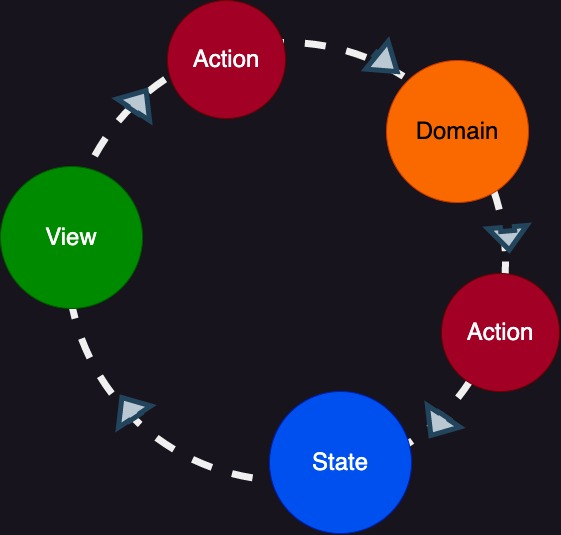
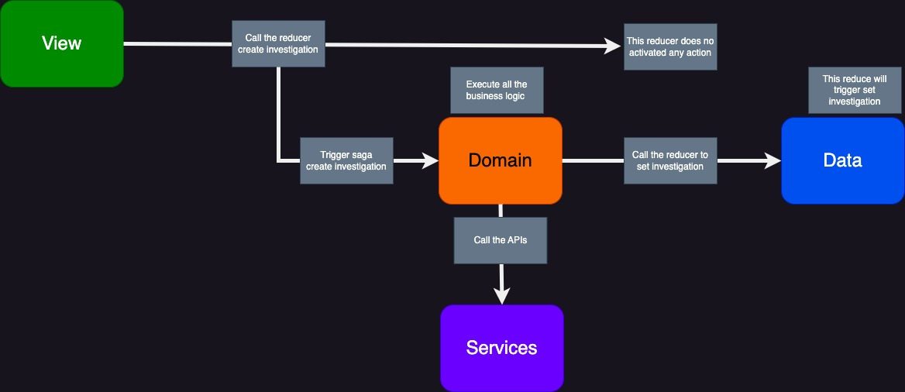

## Flow

It is a self-contained app with the following parts:

- The state, the source of truth that drives our app;
- The screen, a declarative description of the UI based on the current state
- The actions, the events that occur in the app based on user input, and trigger updates in the state or domain actions(business logic)

This is a small example of "one-way data flow":

- State describes the condition of the app at a specific point in time
- The UI is rendered based on that state
- When something happens (such as a user clicking a button), the action trigger some business logic using async call (Saga in our case)
- Saga will trigger a function that will execute the business logic (also will call the APIs) and update the app state
- The UI re-renders based on the new state

<br>



<br>

In our example :

- There is a Button at [`WhatIsTheProblemScreen`](./src/views/WhatIsTheProblemScreen/index.tsx) that on it onPress event will dispatch the `investigationReducer.createInvestigation`.
- Saga will be trigger on this event and will be call the [`createInvestigation`](./src/store/duckers/investigation/sagas.ts)
- The function `createInvestigation` will execute all business logic (calling the API)
- In the end `createInvestigation` will dispatch `investigationReducer.setInvestigation`.
- The State will be update in the reducer [`setInvestigation`](./src/store/duckers/investigation/index.ts).
- The UI will be re-render base on the state change

<br>



<br>

## Log

<br>

```shell
 INFO  "onStartNewInvestigationPress : Call the create Investigation action"
 INFO  "Create New Investigation: Start fetching"
 INFO  "Create New Investigation: Get params from the state manager"
 LOG  "Create New Investigation: Values from state manage" {
  "manufacturer": "manufacturer",
  "productType": "product type",
  "model": "model",
  "firstObservations": []
}
 INFO  "Create New Investigation: Call investigate api"
 LOG  "Create New Investigation: This is the response for investigate api" {
  "id": "test"
}
 INFO  "Create New Investigation: Call diagnose api"
 LOG  "Create New Investigation: This is the response for diagnose api" {
  "question": "Question name",
  "display": "test 1",
  "name": "test1",
  "inverted": false,
  "isFirstObservation": false,
  "isGroupAnswer": false,
  "isQuestionPresent": true
}
 INFO  "Create New Investigation: Call historic data api"
 LOG  "Create New Investigation: This is the response for historic data api" []
 INFO  "Create New Investigation: Update the app state"
 INFO  "Set Investigation State: Update investigation state with the new value" {
  "id": "test",
  "question": [
    {
      "question": "Question name",
      "display": "test 1",
      "name": "test1",
      "inverted": false,
      "isFirstObservation": false,
      "isGroupAnswer": false,
      "isQuestionPresent": true
    }
  ],
  "historicData": [],
  "firstObservations": []
}
 LOG  "Create New Investigation: Created with success"


```

<br>

## Screen

<br>


<br>

## Reference

<br>

- [https://cheesecakelabs.com/blog/efficient-way-structure-react-native-projects/
  ](https://cheesecakelabs.com/blog/efficient-way-structure-react-native-projects/)
- [https://medium.com/react-native-training/best-practices-for-creating-react-native-apps-part-1-66311c746df3
  ](https://medium.com/react-native-training/best-practices-for-creating-react-native-apps-part-1-66311c746df3)
- [https://www.freecodecamp.org/news/scaling-your-redux-app-with-ducks-6115955638be/
  ](https://www.freecodecamp.org/news/scaling-your-redux-app-with-ducks-6115955638be/)
- [https://redux.js.org/tutorials/fundamentals/part-2-concepts-data-flow](https://redux.js.org/tutorials/fundamentals/part-2-concepts-data-flow)
